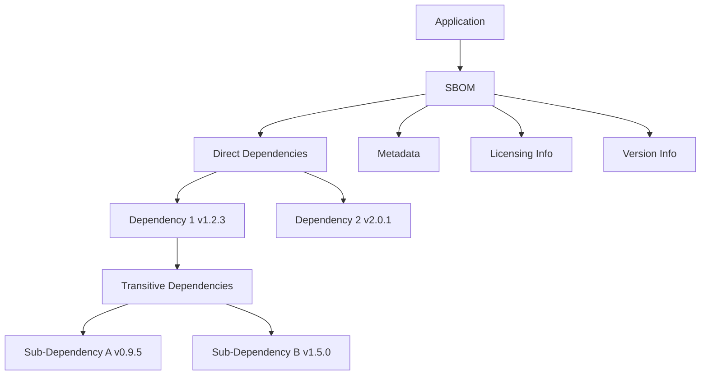

import GlossaryCTA from '@site/src/components/cta/GlossaryCTA/glossaryCTA';

## What is an SBOM?

A Software Bill of Materials (SBOM) is a detailed, machine-readable list of all software components and dependencies within an application. Much like an ingredient list on food packaging, an SBOM provides transparency into the software's composition, including open source libraries, frameworks, and other dependencies, along with their version and licensing information.



The diagram above illustrates how an SBOM provides a comprehensive inventory of all software components, including direct and transitive dependencies, along with essential metadata.

## Why do SBOMs Matter?

SBOMs are essential for several reasons:

- **Security:** They help identify vulnerabilities by providing a clear view of all components and dependencies, allowing for quick action when new threats are discovered.
- **Compliance:** Many regulations and standards require transparency in software components, and SBOMs help meet these requirements.
- **Risk Management:** By understanding what components are in use, organizations can better assess and manage risks associated with third-party software.
- **Incident Response:** In the event of a security incident, SBOMs provide a detailed inventory that can speed up response and recovery efforts.
- **Supply Chain Transparency:** They enhance visibility into the software supply chain, ensuring that all components are accounted for and verified.

## Where are SBOMs stored and how are they used?

SBOMs are typically stored in:

- **Version Control Systems:** Integrated with source code repositories to ensure they are updated alongside the software.
- **Artifact Repositories:** Can be directly embedded in an OCI compliant image.

By maintaining SBOMs in these locations, organizations ensure they are readily accessible for security assessments, audits, and compliance checks.

## Common SBOM Formats

Three widely adopted SBOM formats include:

- **SPDX (Software Package Data Exchange):** An ISO standard maintained by the Linux Foundation
- **CycloneDX:** A lightweight format focused on security, maintained by OWASP
- **SWID (Software Identification Tags):** An ISO standard for software identification and management

## How to generate an SBOM

SBOMs can be generated using various tools and methods. Here are some commonly used tools:

- **Syft:** A popular tool for generating SBOMs from container images and filesystems. It supports various formats like SPDX, CycloneDX, and its own format.
- **The SBOM Tool:** Developed by Microsoft, this tool is highly scalable and enterprise-ready. It generates SBOMs in SPDX format and supports various package managers.
- **CycloneDX Generator (cdxgen):** The official OWASP SBOM tool, supporting a wide range of programming languages. It outputs SBOMs in CycloneDX format.
- **SPDX SBOM Generator:** Supports multiple package managers and outputs SBOMs in SPDX format.
- **Tern:** Generates SBOMs from container images and Dockerfiles, focusing on license information and dependency tracking.
- **Distr:** Once the feature is enabled, SBOMs are automatically generated upon pushing an artifact to the registry.

Here are some examples of how to generate SBOMs using these tools:

```bash
# Using Syft for container images and filesystems
syft alpine:latest -o cyclonedx-json > alpine-sbom.json

# Using CycloneDX tools for Maven projects
mvn org.cyclonedx:cyclonedx-maven-plugin:makeAggregateBom

# Using SPDX tools for Node.js projects
npm install -g @spdx/spdx-sbom-generator
spdx-sbom-generator -p ./

# Push a sample image to Distr registry using ORAS and automatically generate an SBOM
oras push registry.distr.sh/my-organization/my-application:1.0.0 \
    ./sample-image.tar:application/vnd.oci.image.layer.v1.tar
```

These tools provide flexibility and support for various formats and environments, making it easier to integrate SBOM generation into your development workflow.

## Best Practices for Implementing SBOMs

To maximize the effectiveness of SBOMs:

- Automate SBOM generation in your CI/CD pipeline.
- Keep SBOMs updated with each release.
- Securely store SBOMs while ensuring accessibility for security teams.
- Integrate SBOMs into vulnerability management processes.
- Include both direct and transitive dependencies.
- Use automated tools to validate SBOM completeness.

By following these best practices and utilizing tools like ORAS for managing SBOMs in OCI-compliant registries, organizations can enhance their software supply chain security and maintain comprehensive documentation of their software components.

<GlossaryCTA title="SBOM" />

## Key Terms Recap

- **SBOM:** A comprehensive inventory of software components
- **Software Supply Chain Security:** Securing all components and processes in software development and deployment
- **Dependencies:** External software packages your application relies on
- **Transitive Dependencies:** Dependencies of your dependencies
- **Vulnerability Management:** Identifying, classifying, remediating, and mitigating software vulnerabilities
