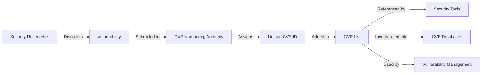
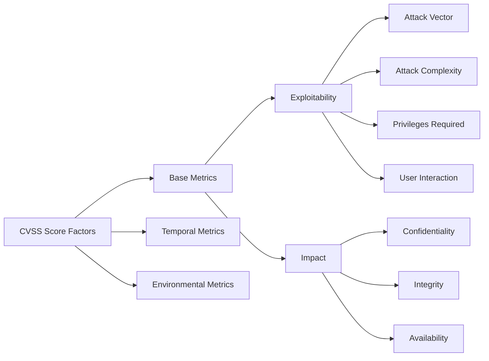
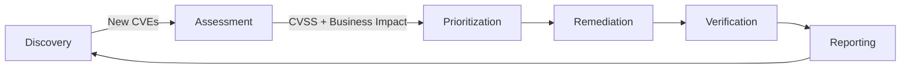

import GlossaryCTA from '@site/src/components/cta/GlossaryCTA/glossaryCTA';

## What is a CVE?

Common Vulnerabilities and Exposures (CVE) is a standardized system for identifying, cataloging, and referencing known cybersecurity vulnerabilities.
Each CVE entry receives a unique identifier
(e.g., [CVE-2021-44228](https://nvd.nist.gov/vuln/detail/cve-2021-44228) for [Log4Shell](https://en.wikipedia.org/wiki/Log4Shell)) that helps security professionals,
software developers, and users consistently track and address specific security flaws across different platforms and tools.

## The Significance of CVEs in Cybersecurity

CVEs form the foundation of modern vulnerability management by providing:

- **Universal Reference System**: A common language for discussing specific security flaws
- **Standardized Documentation**: Consistent documentation of vulnerabilities across different platforms
- **Remediation Prioritization**: Data to help organizations focus on the most critical fixes
- **Security Coordination**: Enabling vulnerability disclosure and patching coordination
- **Historical Documentation**: A record of known vulnerabilities for future reference and analysis

When a new vulnerability is discovered, security professionals can use its CVE identifier to locate patches, workarounds, and other critical information regardless of which security tools or platforms they use.

## Who Assigns CVEs?

The CVE program operates through a distributed network of CVE Numbering Authorities (CNAs):

- **MITRE Corporation**: The primary CNA that coordinates the overall CVE program, sponsored by the U.S. Department of Homeland Security's Cybersecurity and Infrastructure Security Agency (CISA)
- **Vendor CNAs**: Major technology companies like Microsoft, Google, Apple, and Red Hat can assign CVEs directly for their own products
- **Third-party CNAs**: Security research organizations, academic institutions, and regional coordination centers
- **Global Coverage**: The program includes hundreds of CNAs across different organizations and geographies

This distributed approach allows for faster vulnerability publication, as vendors can assign CVEs without waiting for central approval. When a security researcher discovers a vulnerability, they typically contact either the affected vendor (if they're a CNA) or MITRE directly to report a CVE assignment.

  <em>Fig 1: The CVE assignment and documentation process</em>

This diagram illustrates how vulnerabilities flow from discovery to standardized identification through the CVE system, enabling consistent tracking and remediation across the security ecosystem.

## Important Considerations About CVEs

It's crucial to understand that a CVE assignment doesn't always indicate a fully understood or fixed vulnerability. CVEs may be issued before patches exist or complete fixes are developed, with technical details varying significantly between entries, some comprehensive while others (particularly during embargo periods) remain limited.

The mere existence of a CVE doesn't guarantee the vulnerability has been confirmed in all reported contexts, and the timing between discovery, assignment, and public disclosure can vary substantially based on severity and responsible disclosure practices. Security professionals have to carefully read CVE details and associated references rather than simply checking if a CVE exists for a particular issue.

## CVE Identifiers and CVSS Scoring System

### Anatomy of a CVE Identifier

A CVE ID follows a standard format: CVE-YEAR-NUMBER. For example:

- **CVE-2021-44228**: The infamous Log4Shell vulnerability
- **CVE-2014-0160**: The Heartbleed bug in OpenSSL
- **CVE-2017-5715**: The Spectre vulnerability affecting CPUs

The year portion indicates when the CVE was assigned (not necessarily when the vulnerability was discovered), and the number is a unique sequence identifier.

### CVE Severity Assessment: Understanding CVSS

The Common Vulnerability Scoring System (CVSS) provides standardized severity scores for CVEs. CVSS scores range from 0 to 10 and generally follow these severity levels:

- **Critical (9.0-10.0)**: Vulnerabilities that allow remote code execution without authentication
- **High (7.0-8.9)**: Significant vulnerabilities requiring immediate attention
- **Medium (4.0-6.9)**: Important vulnerabilities with mitigating factors
- **Low (0.1-3.9)**: Vulnerabilities with minimal impact or difficult exploitation

  <em>Fig 2: Components of the CVSS scoring system</em>

This diagram shows the components that contribute to a CVSS score, which helps security teams prioritize vulnerability remediation based on risk.

## Defining Vulnerabilities in the Context of CVEs

In cybersecurity, a vulnerability is a weakness or flaw in a system or application that could be exploited to compromise security. These can include:

- **Software bugs**: Coding errors that create security implications
- **Configuration errors**: Systems or applications set up insecurely
- **Design flaws**: Fundamental architectural issues that create security problems
- **Implementation weaknesses**: Proper designs implemented incorrectly

CVEs specifically document vulnerabilities that:

- Have security implications
- Affect specific software, firmware, or hardware
- Can be fixed or mitigated
- Impact users beyond the discoverer

## What Is an Exploit?

An exploit is a program, script, or technique designed to take advantage of a known security vulnerability. While vulnerabilities represent the weakness in a system, exploits are the tools or methods that attackers use to leverage those weaknesses for unauthorized access or other malicious purposes.

### Types of Exploits

Exploits generally fall into several categories:

- **Remote Exploits**: Allow attackers to target a vulnerable system over a network without requiring prior access
- **Local Exploits**: Require the attacker to already have some level of access to the target system, often used to escalate privileges or move laterally
- **Zero-Day Exploits**: Target vulnerabilities that have no public CVE identifier or patch available yet
- **Client-Side Exploits**: Target vulnerabilities in applications that users run (browsers, document readers, etc.)
- **Server-Side Exploits**: Target vulnerabilities in server applications and services

### How Exploits Relate to CVEs

Once a vulnerability is disclosed and receives a CVE ID, security researchers may develop or release associated exploits to demonstrate the risk. These are often documented in:

- **[Exploit-DB](https://www.exploit-db.com/)**: A repository of public exploits and corresponding vulnerable software
- **[Metasploit Framework](https://www.metasploit.com/)**: An open-source penetration testing platform that includes many exploit modules
- **Security advisories**: Vendor and CERT notifications may reference exploit techniques
- **Bug trackers**: Public issue tracking systems where vulnerabilities are documented
- **Academic papers**: Detailed analysis of vulnerabilities and exploitation techniques

⚠️ **Important**: While exploits serve as essential tools in security testing and vulnerability verification, using them without proper authorization against systems you don't own is illegal in most jurisdictions and violates professional ethics in cybersecurity.

### Exploit Development and Availability

Not all CVEs have public exploits available. Factors affecting exploit availability include:

- **Vulnerability complexity**: Some vulnerabilities are theoretically exploitable but difficult to weaponize
- **Researcher decisions**: Some researchers choose not to publish exploit code for critical vulnerabilities
- **Vendor coordination**: Responsible disclosure often delays public exploit release
- **Target value**: High-value vulnerabilities may have exploits developed privately and never shared publicly

Understanding the relationship between CVEs and exploits helps security professionals better assess the real-world risk associated with specific vulnerabilities.

## Key CVE Resources

### Official CVE List and Databases

The official CVE List is maintained by the MITRE Corporation, but several enhanced databases provide additional details and search capabilities:

- **[National Vulnerability Database (NVD)](https://nvd.nist.gov/)**: The U.S. government repository with enhanced CVE data
- **[CVE Details](https://www.cvedetails.com/)**: User-friendly interface for exploring and analyzing CVEs
- **[MITRE CVE](https://cve.mitre.org/)**: The official source for CVE records
- **[Exploit Database](https://www.exploit-db.com/)**: Links CVEs to specific exploit techniques
- **[VulnDB](https://vulndb.cyberriskanalytics.com/)**: Commercial database with additional vulnerabilities not in CVE

These resources allow security professionals to search for vulnerabilities by software vendor, product name, version, and other criteria.

## CVE vs. CWE: Understanding the Difference

Common Vulnerabilities and Exposures (CVE) and Common Weakness Enumeration (CWE) are complementary but distinct classification systems:

- **CVE**: Identifies specific vulnerabilities in particular software or systems (e.g., CVE-2021-44228 for the Log4Shell vulnerability in Log4j)
- **CWE**: Categorizes types of weaknesses (e.g., CWE-79 for Cross-Site Scripting)

In practical terms:

- A CWE describes a class of vulnerability
- A CVE identifies a specific instance of a vulnerability in a particular product
- Many CVEs may be classified under the same CWE

Security professionals use both systems together to understand both the specific vulnerabilities (CVEs) and the underlying weakness patterns (CWEs) that need to be addressed.

## The Vulnerability Management Process with CVEs

Organizations use CVEs as part of a structured vulnerability management process:

1. **Identification**: Monitoring CVE announcements and vulnerability disclosures relevant to their environment
2. **Assessment**: Evaluating which vulnerabilities pose a risk to the specific environment
3. **Prioritization**: Using CVSS scores and business context to determine which vulnerabilities to address first
4. **Remediation**: Applying patches, implementing workarounds, or accepting risk
5. **Verification**: Confirming that remediation efforts successfully addressed the vulnerability
6. **Reporting**: Documenting the organization's vulnerability status and remediation efforts

  <em>Fig 3: The vulnerability management lifecycle</em>

This cycle is continuous, as new vulnerabilities are constantly being discovered and added to the CVE list.

## Addressing Vulnerabilities: How Companies Fix Security Flaws

Organizations employ several methods to remediate vulnerabilities identified by CVEs:

- **Patching**: Applying vendor-provided updates to fix the vulnerability
- **Configuration changes**: Adjusting settings to mitigate the vulnerability
- **Compensating controls**: Implementing additional security measures when direct fixes aren't available
- **Application firewalls**: Blocking exploitation attempts at the network level
- **Runtime protection**: Using security tools that prevent exploitation during execution
- **Integrated Security Platforms**: Using solutions like Distr that not only detect vulnerabilities in artifacts stored in the registry but also recommend and facilitate applying patches
- **Minimal Base Images**: Using CVE-free or minimal footprint container images like Chainguard Images, which are built with security in mind and significantly reduce the attack surface

The specific approach depends on the nature of the vulnerability, the affected system, and operational constraints.

## How to Stay Informed About New CVEs

Rather than only focusing on detecting and patching vulnerabilities after they're discovered, proactive organizations adopt preventative approaches:

- **Minimal Attack Surface**: Using CVE-free container images like Chainguard Images that are specifically built to minimize the potential for vulnerabilities
- **DevSecOps Practices**: Integrating security throughout the development lifecycle to catch issues before they reach production
- **Dependency Minimization**: Reducing the number of dependencies to lower the chance of inheriting vulnerabilities
- **Principles of Least Privilege**: Limiting access rights to minimize the impact of potential exploits
- **Infrastructure as Code**: Using validated, versioned infrastructure definitions that can be easily updated when vulnerabilities are discovered

## CVE Integration in Security Management Tools

Security teams typically interact with CVEs through various tools that integrate CVE data:

- **Vulnerability Management Systems**: Enterprise platforms like Rapid7 InsightVM, Tenable.io, and Microsoft Defender Vulnerability Management that track, prioritize, and manage vulnerabilities using CVE data
- **Configuration Management Databases**: Systems that catalog software and hardware components and their associated CVEs
- **Patch Management Solutions**: Tools that correlate patches with CVEs to ensure complete remediation
- **Threat Intelligence Platforms**: Systems that contextualize CVEs with known threat actor activities
- **Software Composition Analysis (SCA)**: Tools like OWASP Dependency-Check, Snyk, and GitHub Dependabot that identify dependencies with known CVEs
- **Artifact Registries with Security Features**: Platforms like Distr that track CVEs affecting stored artifacts, recommend patches, and facilitate remediation
- **Secure Container Registries**: Solutions that offer CVE-free base images like Chainguard Images or enable easy migration to more secure alternatives

These tools help organizations monitor, track, and remediate vulnerabilities documented in the CVE system.

## The Limitations of CVEs

While CVEs provide tremendous value to the security community, they have several important limitations:

- **Coverage Gaps**: Many vulnerabilities never receive a CVE identifier, especially:

  - Issues in less popular or open source software without dedicated security teams
  - Vulnerabilities discovered and fixed internally before public disclosure
  - Configuration weaknesses (which may be covered by the NIST National Vulnerability Database but not assigned CVEs)

- **Publication Delays**: Responsible disclosure processes often include embargo periods where a CVE may be reserved but not published, creating a gap between assignment and public availability

- **Inconsistent Detail**: The level of technical information varies significantly between CVEs, depending on who submitted it and the disclosure status

- **Limited Scope**: CVEs primarily focus on known software/hardware flaws, not misconfigurations, weak credentials, social engineering, or other security issues

- **Prioritization Challenges**: The sheer volume of CVEs (over 20,000 new entries annually) makes it difficult for organizations to effectively prioritize which vulnerabilities to address first

Understanding these limitations helps security teams develop more comprehensive vulnerability management strategies that go beyond simply tracking CVEs.

## How to Report a CVE

If you discover a vulnerability, you can report a CVE ID through the following process:

1. **Determine the appropriate CNA**: Contact the vendor if they're a CNA, or reach out to MITRE directly
2. **Prepare vulnerability information**: Document technical details, affected versions, and potential impact
3. **Submit the report**: Follow the CNA's submission process (typically through a web form or email)
4. **Coordinate disclosure**: Work with the vendor on responsible disclosure timelines
5. **Verify publication**: Confirm the CVE appears in the official CVE List once the disclosure period ends

For detailed guidance, refer to [MITRE's CVE report process](https://cve.mitre.org/cve/report_id.html) or the vendor-specific security vulnerability reporting instructions.

<GlossaryCTA title="security" />

## Key Terms

- **CVE**: Common Vulnerabilities and Exposures - the standard for identifying and documenting specific security vulnerabilities
- **CVSS**: Common Vulnerability Scoring System - the method for assigning severity ratings to documented vulnerabilities
- **Vulnerability**: A weakness in a system that could be exploited to compromise security
- **CWE**: Common Weakness Enumeration - a classification system for vulnerability types
- **Zero-day**: A vulnerability that is exploited before it's publicly known or documented with a CVE
- **Exploit**: Either a technique or actual code that takes advantage of a vulnerability
- **Patch**: A software update that fixes a vulnerability
- **CNA**: CVE Numbering Authority - organizations authorized to assign CVE IDs
- **NVD**: National Vulnerability Database - the U.S. government repository of vulnerability documentation
